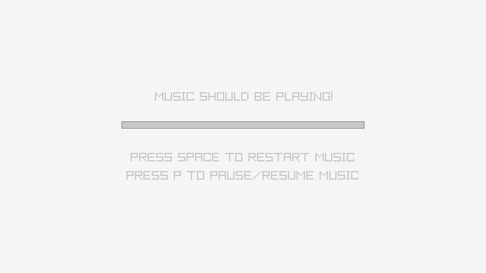

# Raylib bindings and examples for XD Pascal
This is an adaptation of Donald Duvall's [Raylib bindings for Free Pascal](https://github.com/tazdij/raylib-pas) to support my own [XD Pascal](https://github.com/vtereshkov/xdpw) compiler.

## Prerequisites
Raylib has been tested on Windows 7 and Windows 10 in the following configuration:
* Libraries:
    * `raylib.dll` (version 2.6.0, 32-bit, MSVC compatible, 1897472 bytes)
    * `vcruntime140d.dll` (32-bit, 111952 bytes)
    * `ucrtbased.dll` (32-bit, 1647104 bytes)
* Resources taken from the original bindings for Free Pascal.

## Screenshots
_models_first_person_maze_

_models_animation_

_textures_particles_blending_

_core_2d_camera_

_audio_music_stream_

