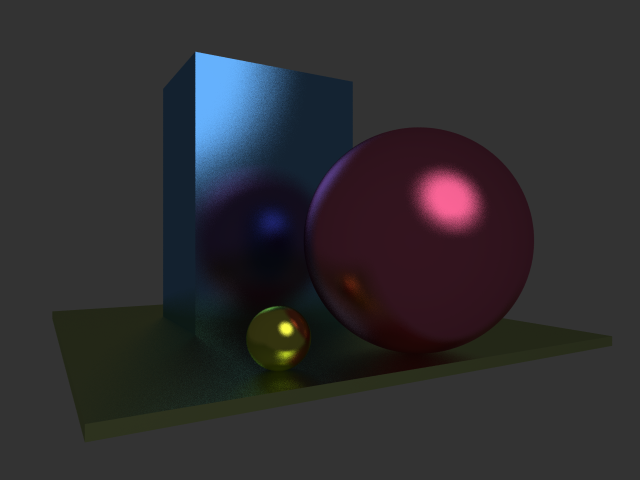

# XD Pascal for Windows

_Dedicated to my father Mikhail Tereshkov, who instilled in me a taste for engineering_ 

## Summary
XD Pascal is a small embeddable self-hosting compiler for a Pascal language dialect. Any comments, suggestions, or bug reports are appreciated. Feel free to contact the author on GitHub or by e-mail VTereshkov@mail.ru. Enjoy.

### Features
* [Go-style methods and interfaces](https://medium.com/@vtereshkov/how-i-implemented-go-style-interfaces-in-my-own-pascal-compiler-a0f8d37cd297?source=friends_link&sk=72a20752cb866c716daac13abc1fab22)
* Native x86 code generation (32 bit Windows executables)
* Support for both console and GUI applications
* No external assembler or linker needed
* Floating-point arithmetic using the x87 FPU
* [Integration](https://github.com/vtereshkov/raylib-xdpw) with the [Raylib](https://www.raylib.com) game development library
* Integration with Geany IDE
* Compiler source for Delphi 6/7, Free Pascal and XD Pascal itself (Delphi 2009+ migration is [straightforward](https://github.com/vtereshkov/xdpw/issues/2#issuecomment-573929657))


## Detailed description

### Usage
Type in the command prompt:
```
xdpw <file.pas>
```
The source file should be specified with its extension (.pas).
 
### Language

XD Pascal is similar to Delphi 6/7 and Free Pascal with the following changes:

#### Enhancements
* The compiler is self-hosting
* The compiler is extremely compact (~10000 lines) and can be easily embedded into larger systems
* Go-style methods and interfaces are supported

#### Differences
* Strings are null-terminated arrays of characters (C style), but indexed from 1 for Pascal compatibility
* The `Text` type is equivalent to `file`. It can be used for both text and untyped files
* Method calls and procedural variable calls require parentheses even for empty parameter lists

#### Limitations
* No classical (C++/Delphi style) object-oriented programming
* No visual components
* Units cannot be compiled separately
* Only peephole optimizations
* `Extended` is equivalent to `Double`
* No `High` and `Low` functions for open arrays. Open array length should be explicitly passed to a subroutine 
* Statement labels cannot be numerical 

#### Formal grammar
```
ProgramOrUnit = [("program" | "unit") Ident ";"] 
                ["interface"] [UsesClause] Block "." .
                
UsesClause = "uses" Ident {"," Ident} ";" .                

Block = { Declarations } (CompoundStatement | "end") .

Declarations = DeclarationSection ["implementation" DeclarationSection] .

DeclarationSection = LabelDeclarations |
                     ConstDeclarations | 
                     TypeDeclarations |
                     VarDeclarations |
                     ProcFuncDeclarations .
                     
Initializer = ConstExpression |
              StringLiteral |
              "(" Initializer {"," Initializer} ")" |
              "(" Ident ":" Initializer {";" Ident ":" Initializer} ")" |
              SetConstructor .                     
               
LabelDeclarations = "label" Ident {"," Ident} ";"               
             
ConstDeclarations = (UntypedConstDeclaration | TypedConstDeclaration)
               {";" (UntypedConstDeclaration | TypedConstDeclaration)} .

UntypedConstDeclaration = "const" Ident "=" ConstExpression .
                                 
TypedConstDeclaration = "const" Ident ":" Type "=" Initializer .

TypeDeclarations = "type" Ident "=" Type ";" {Ident "=" Type ";"} .

VarDeclarations = "var" IdentList ":" Type ["=" Initializer] ";" 
                       {IdentList ":" Type ["=" Initializer] ";"} .

ProcFuncDeclarations = ("procedure" | "function") Ident 
                       [Receiver] [FormalParams] [":" TypeIdent] 
                       [CallModifier] ";" [(Directive | Block) ";"] .

Receiver = "for" Ident ":" TypeIdent .

CallModifier = "stdcall" | "cdecl" .

Directive = "forward" | "external" ConstExpression .         

ActualParams = "(" [ (Expression | Designator) |
                {"," (Expression | Designator)} ] ")" .

FormalParams = "(" FormalParamList {";" FormalParamList} ")" .
              
FormalParamList = ["const" | "var"] IdentList [":" ["array" "of"] TypeIdent] 
                                              ["=" ConstExpression] .             

IdentList = Ident {"," Ident} .

Type = "(" Ident {"," Ident} ")" |
       "^" TypeIdent |
       ["packed"] "array" "[" Type {"," Type} "]" "of" Type |
       ["packed"] "record" Fields "end" |
       ["packed"] "interface" FixedFields "end" |
       ["packed"] "set" "of" Type |
       ["packed"] "string" [ "[" ConstExpression "]" ] |
       ["packed"] "file" ["of" Type] |
       ConstExpression ".." ConstExpression |
       ("procedure" | "function") [FormalParams] [":" TypeIdent] [CallModifier] |
       Ident .
       
Fields = FixedFields 
           ["case" [Ident ":"] Type "of" 
               ConstExpression {"," ConstExpression} ":" "(" Fields ")"
          {";" ConstExpression {"," ConstExpression} ":" "(" Fields ")"}] [";"] .       
       
FixedFields = IdentList ":" Type {";" IdentList ":" Type} .       
       
TypeIdent = "string" | "file" | Ident .       

Designator = BasicDesignator {Selector} .

BasicDesignator = Ident |
                  Ident [ActualParams] |
                  Ident "(" Expression ")" .

Selector = "^" | 
           "[" Expression {"," Expression} "]" | 
           "." Ident | 
           "(" ActualParams ")".

Statement = [Label ":"] [ (Designator | Ident) ":=" Expression | 
                          (Designator | Ident) [ActualParams] {Selector} |
                          CompoundStatement |
                          IfStatement |
                          CaseStatement |
                          WhileStatement |
                          RepeatStatement | 
                          ForStatement |
                          GotoStatement |
                          WithStatement ] .
                          
Label = Ident .                          

StatementList = Statement {";" Statement} .

CompoundStatement = "begin" StatementList "end" .

IfStatement = "if" Expression "then" Statement ["else" Statement] .

CaseStatement = "case" Expression "of" CaseElement {";" CaseElement} 
                    [";"] ["else" StatementList] [";"] "end" .
                    
WhileStatement = "while" Expression "do" Statement .

RepeatStatement = "repeat" StatementList "until" Expression .

ForStatement = "for" Ident ":=" Expression ("to" | "downto") Expression "do" Statement.

GotoStatement = "goto" Label .

WithStatement = "with" Designator {"," Designator} "do" Statement .                    
 
CaseElement = CaseLabel {"," CaseLabel} ":" Statement .

CaseLabel = ConstExpression [".." ConstExpression] .

ConstExpression = Expression .

Expression = SimpleExpression [("="|"<>"|"<"|"<="|">"|">="|"in") SimpleExpression] .

SimpleExpression = ["+"|"-"] Term {("+"|"-"|"or"|"xor") Term}.

Term = Factor {("*"|"/"|"div"|"mod"|"shl"|"shr"|"and") Factor}.

Factor = (Designator | Ident) [ActualParams] {Selector} |
         Designator |
         "@" Designator | 
         Number | 
         CharLiteral |
         StringLiteral |  
         "(" Expression ")" | 
         "not" Factor |
         SetConstructor |
         "nil" |
         Ident "(" Expression ")" {Selector} .
         
SetConstructor = "[" [Expression [".." Expression] 
                     {"," Expression [".." Expression]}] "]" .         

Ident = (Letter | "_") {Letter | "_" | Digit}.

Number = "$" HexDigit {HexDigit} | 
         Digit {Digit} ["." {Digit}] ["e" ["+" | "-"] Digit {Digit}] .

CharLiteral = "'" (Character | "'" "'") "'" | 
              "#" Number .

StringLiteral = "'" {Character | "'" "'"} "'".
```

### Compiler 
The compiler is based on a recursive descent parser. It directly builds a Windows PE executable without using any external assembler or linker.

#### Directives
* `$APPTYPE` - Set application type. Examples: `{$APPTYPE GUI}`, `{$APPTYPE CONSOLE}`
* `$UNITPATH` - Set additional unit search path. Example: `{$UNITPATH ..\units\}`

#### Optimizations
Some simple peephole optimizations are performed:
* Push/pop elimination
* FPU push/pop elimination
* Local variable loading optimizations
* Array element access optimizations
* Record field access optimizations
* Assignment optimizations
* Comparison optimizations
* Condition testing optimizations

#### Inlined procedures and functions
The following identifiers are implemented as part of the compiler. Their names are not reserved words and can be locally redefined by the user.
```pascal
procedure Inc(var x: Integer);
procedure Dec(var x: Integer);
procedure Read([var F: file;] var x1 {; var xi});
procedure Write([var F: file;] x1[:w[:d]] {; xi[:w[:d]]});
procedure ReadLn([var F: file;] var x1 {; var xi});
procedure WriteLn([var F: file;] x1[:w[:d]] {; xi[:w[:d]]});
procedure New(var P: Pointer);
procedure Dispose(var P: Pointer);
procedure Break;
procedure Continue;
procedure Exit;
procedure Halt[(const error: Integer)];
function SizeOf(var x | T): Integer;
function Ord(x: T): Integer;
function Chr(x: Integer): Char;
function Low(var x: T | T): T;
function High(var x: T | T): T;
function Pred(x: T): T;
function Succ(x: T): T;
function Round(x: Real): Integer;
function Abs(x: T): T;
function Sqr(x: T): T;
function Sin(x: Real): Real;  
function Cos(x: Real): Real;  
function Arctan(x: Real): Real;  
function Exp(x: Real): Real;
function Ln(x: Real): Real;
function SqRt(x: Real): Real;
```

### Standard library

#### System unit
```pascal
function Timer: Integer;
procedure GetMem(var P: Pointer; Size: Integer);
procedure FreeMem(var P: Pointer);
procedure Randomize;
function Random: Real;
procedure Assign(var F: file; const Name: string);
procedure Rewrite(var F: file[; BlockSize: Integer]);
procedure Reset(var F: file[; BlockSize: Integer]);
procedure Close(var F: file);
procedure BlockRead(var F: file; var Buf; Len: Integer; var LenRead: Integer);
procedure BlockWrite(var F: file; var Buf; Len: Integer);
procedure Seek(var F: file; Pos: Integer);
function FileSize(var F: file): Integer;
function FilePos(var F: file): Integer;
function EOF(var F: file): Boolean;
function IOResult: Integer;
function Length(const s: string): Integer;
procedure Move(var Source; var Dest; Count: Integer);
function Copy(const S: string; Index, Count: Integer): string;
procedure FillChar(var Data; Count: Integer; Value: Char);
function ParamCount: Integer;
function ParamStr(Index: Integer): string;
procedure Val(const s: string; var Number: Real; var Code: Integer);
procedure Str(Number: Real; var s: string[; DecPlaces: Integer]);
procedure IVal(const s: string; var Number: Integer; var Code: Integer);
procedure IStr(Number: Integer; var s: string);
function UpCase(ch: Char): Char;
```

#### SysUtils unit
```pascal
function IntToStr(n: Integer): string;
function StrToInt(const s: string): Integer;
function FloatToStr(x: Real): string;
function FloatToStrF(x: Real; Format: TFloatFormat; Precision, Digits: Integer): string;
function StrToFloat(const s: string): Real;
function StrToPChar(const s: string): PChar;
function PCharToStr(p: PChar): string;
function StrToPWideChar(const s: string): PWideChar;
function PWideCharToStr(p: PWideChar): string;
```

### Samples
* `factor.pas`   - Integer factorization demo
* `lineq.pas`    - Linear equation solver. Uses `gauss.pas` unit. Requires `eq.txt`, `eqerr.txt`, or similar data file
* `life.pas`     - The Game of Life
* `sort.pas`     - Array sorting demo
* `fft.pas`      - Fast Fourier Transform demo
* `inserr.pas`   - Inertial navigation system error estimation demo. Uses `kalman.pas` unit
* `list.pas`     - Linked list operations demo
* `map.pas`      - Heterogenous list operations and Map function demo. Demonstrates XD Pascal methods and interfaces
* `gui.pas`      - GUI application demo. Uses `windows.pas` unit
* `raytracer.pas`- Raytracer demo. Demonstrates XD Pascal methods and interfaces. Equivalent to `raytracer.go`



### Known issues

Windows Defender antivirus is known to give false positive results on some programs compiled with XD Pascal.
